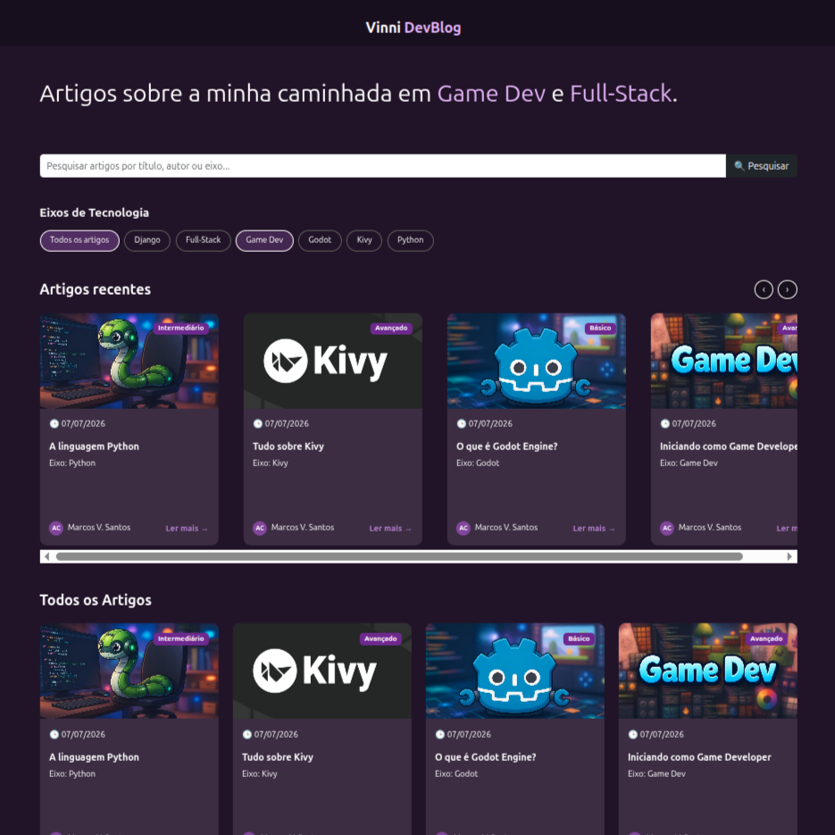
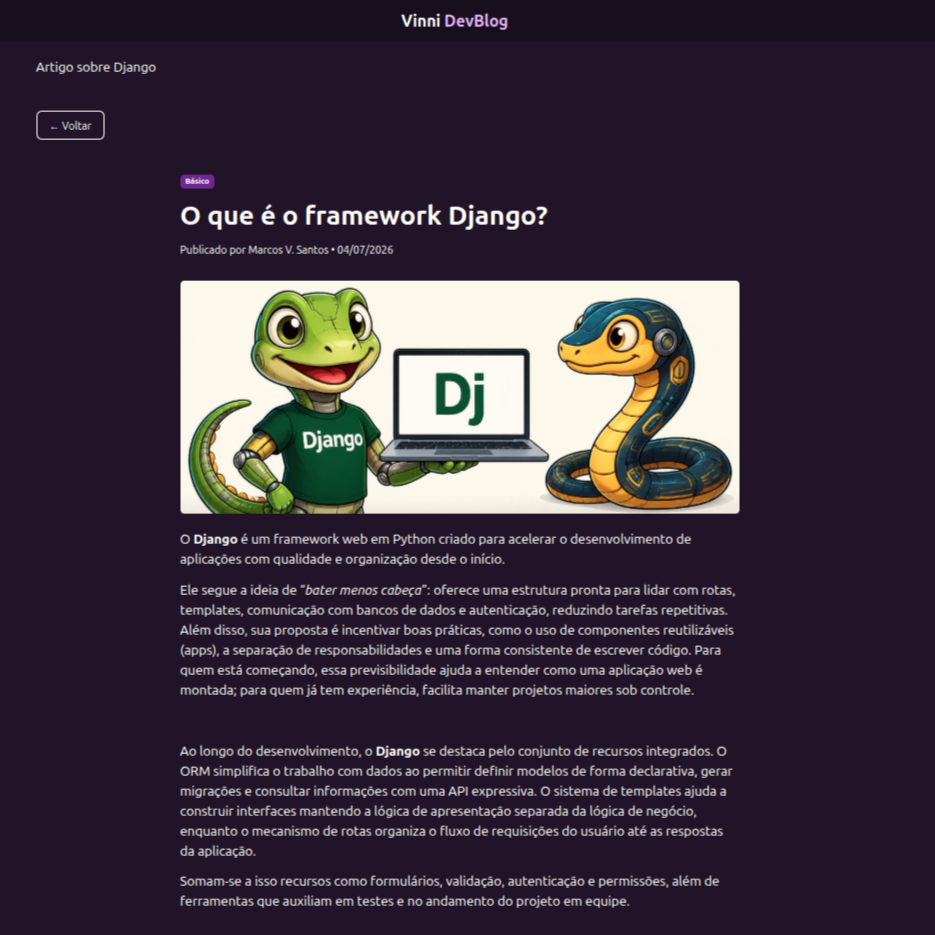
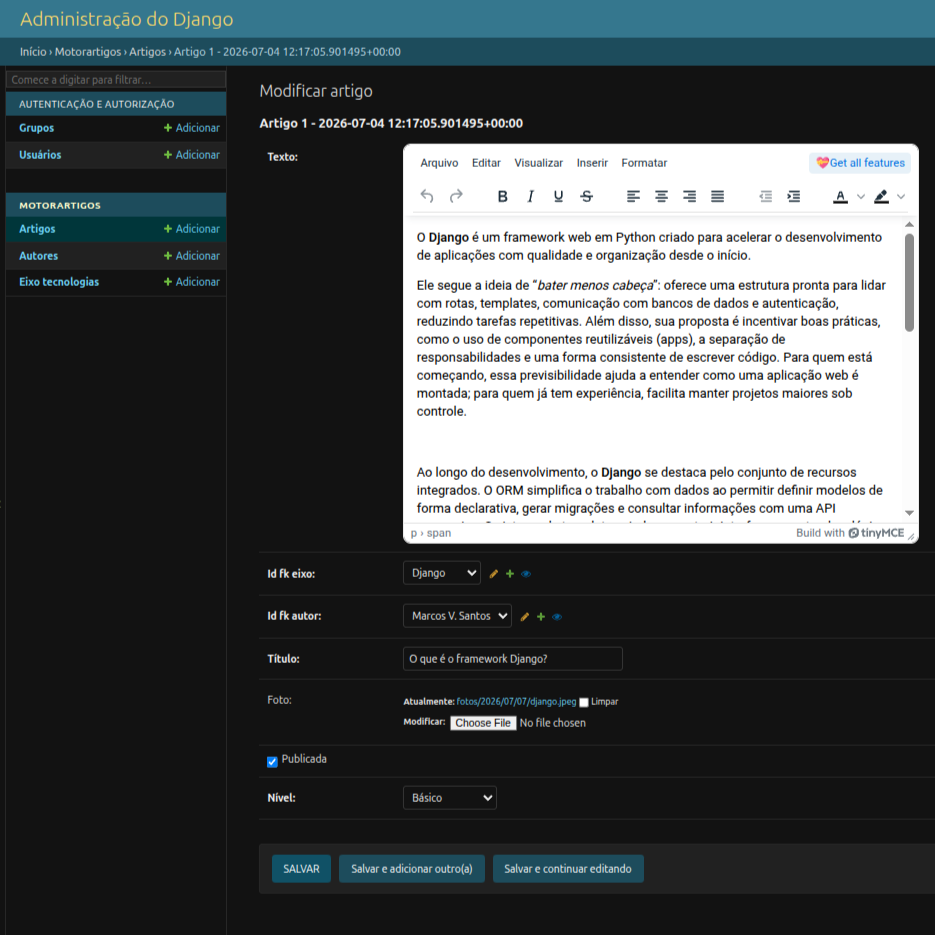

# Blog Python+Django
Projeto desenvolvido durante o curso "__Web Back-End com Python e Django__" no SENAI.

O objetivo foi desenvolver um blog funcional e responsivo utilizando a linguagem Python com o framework Django. O blog seria utilizado para a criação de artigos sobre tecnologias da área de TI.

Ao final do curso, cada aluno pôde personalizar o projeto conforme sua proposta.  
No meu projeto, decidi que seria um blog sobre a minha caminhada como desenvolvedor.  
  
  
  
## Funcionalidades

- Cadastro e autenticação de autores;
- Painel administrativo do Django para gerenciamento do sistema;
- CRUD de artigos, autores e eixos;
- Pesquisa de artigos por título, eixo ou autor;
- Exibição de artigos recentes, todos os artigos e página individual para cada publicação;
- Layout responsivo para desktop, tablet e smartphone.  
  
  
  
## Tecnologias usadas

- Python
- Django
- HTML5, CSS3, Bootstrap 5
- MySQL, SQLite
  
  
  
## Considerações

Eu gostei do resultado final e decidi que não é necessário outras alterações neste projeto.  
Ainda assim, as modificações que eu faria seriam:
- Mover "ARTIGOS RECENTES" para a lateral do blog, em um tamanho menor e mostrando os 3 últimos artigos de forma vertical;
- Limitar o número de "TODOS OS ARTIGOS" para 12, com um botão para carregar mais 4 e assim sucessivamente;
- Adicionar um espaço para comentários de visitantes dentro de artigo;
- Personalização do front-end da página de login e senha de usuários/autores e do painel administrativo.
